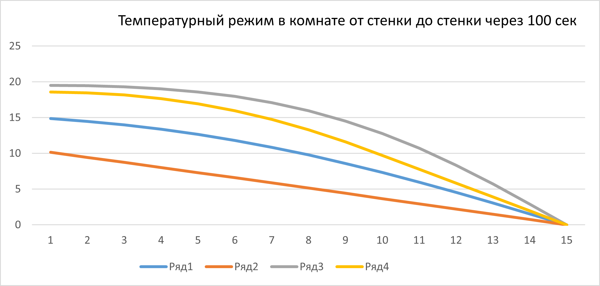
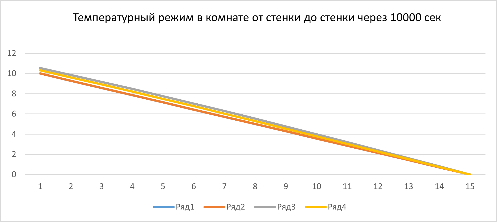

# Heat Distribution Simulation

## Task Description

Create a program to simulate heat distribution in a room. The room has an internal temperature of 20°C, while one wall is exposed to the outside environment with a temperature of 0°C. The simulation will use several wall materials, including composite materials, to analyze their thermal insulation properties.

## Materials Used

1. **Ceramic Brick**: Thermal conductivity ( alpha = 5.2 * 10^{-7} ) m²/s
2. **Sandstone**: Thermal conductivity ( alpha = 1.14 * 10^{-6} ) m²/s
3. **Pine Wood**: Thermal conductivity ( alpha = 8.2 * 10^{-8} ) m²/s
4. **Wood + Sandstone**: Composite material with alternating coefficients

## Results

### After 100 Seconds

The following tables show the temperature distribution along the wall after 100 seconds for each material:

| Position | Ceramic Brick | Sandstone | Pine Wood | Wood + Sandstone |
|----------|---------------|-----------|-----------|------------------|
| 1        | 14.8724       | 10.1426   | 19.499    | 18.5741          |
| 2        | 14.452        | 9.43782   | 19.4615   | 18.4693          |
| 3        | 13.9641       | 8.73033   | 19.3117   | 18.1734          |
| 4        | 13.3737       | 8.01934   | 19.0304   | 17.669           |
| 5        | 12.6382       | 7.30477   | 18.5906   | 16.9405          |
| 6        | 11.8145       | 6.58665   | 17.9579   | 15.9744          |
| 7        | 10.8338       | 5.86504   | 17.0938   | 14.7619          |
| 8        | 9.78284       | 5.14012   | 15.9603   | 13.3025          |
| 9        | 8.58164       | 4.41211   | 14.5259   | 11.6063          |
| 10       | 7.32876       | 3.68131   | 12.772    | 9.69559          |
| 11       | 5.95144       | 2.9481    | 10.6982   | 7.77205          |
| 12       | 4.54061       | 2.21289   | 8.32685   | 5.83815          |
| 13       | 3.04757       | 1.47613   | 5.70451   | 3.89645          |
| 14       | 1.53815       | 0.738332  | 2.90013   | 1.94953          |
| 15       | 0             | 0         | 0         | 0                |

**Visualization**: 

### After 10,000 Seconds

The following tables show the temperature distribution along the wall after 10,000 seconds for each material:

| Position | Ceramic Brick | Sandstone | Pine Wood | Wood + Sandstone |
|----------|---------------|-----------|-----------|------------------|
| 1        | 10.0002       | 10        | 10.5375   | 10.3103          |
| 2        | 9.28597       | 9.28571   | 9.86142   | 9.61805          |
| 3        | 8.5717        | 8.57143   | 9.17285   | 8.9177           |
| 4        | 7.85742       | 7.85714   | 8.47103   | 8.20878          |
| 5        | 7.14313       | 7.14286   | 7.75569   | 7.49117          |
| 6        | 6.42884       | 6.42857   | 7.02687   | 6.76495          |
| 7        | 5.71454       | 5.71429   | 6.28488   | 6.03041          |
| 8        | 5.00024       | 5         | 5.53032   | 5.28804          |
| 9        | 4.28593       | 4.28571   | 4.76409   | 4.53856          |
| 10       | 3.57161       | 3.57143   | 3.98733   | 3.78282          |
| 11       | 2.8573        | 2.85714   | 3.20142   | 3.0267           |
| 12       | 2.14298       | 2.14286   | 2.40792   | 2.27029          |
| 13       | 1.42865       | 1.42857   | 1.60859   | 1.51365          |
| 14       | 0.714327      | 0.714286  | 0.805297  | 0.756863         |
| 15       | 0             | 0         | 0         | 0                |

**Visualization**: 

## Conclusions

- **Pine Wood** is the best material for wall construction due to its low thermal conductivity.
- **Wood + Sandstone** performs better than **Sandstone** alone, thanks to the insulating properties of wood.
- **Sandstone** has the highest thermal conductivity and is the least effective material.

After 10,000 seconds, the temperature difference between the materials is minimal, with the internal temperature stabilizing around 10°C and gradually decreasing to 0°C near the outside environment.

